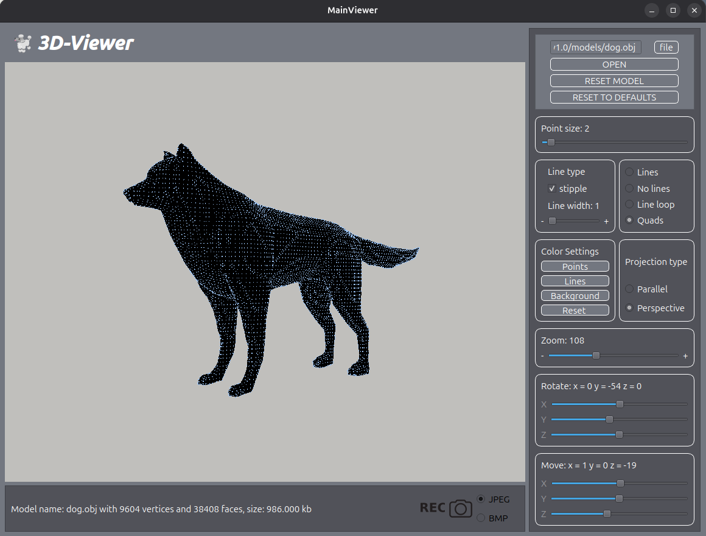
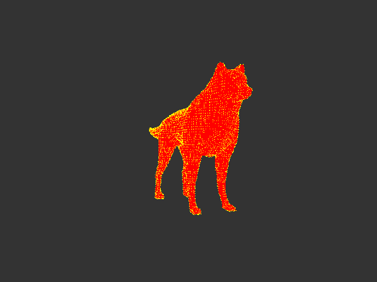
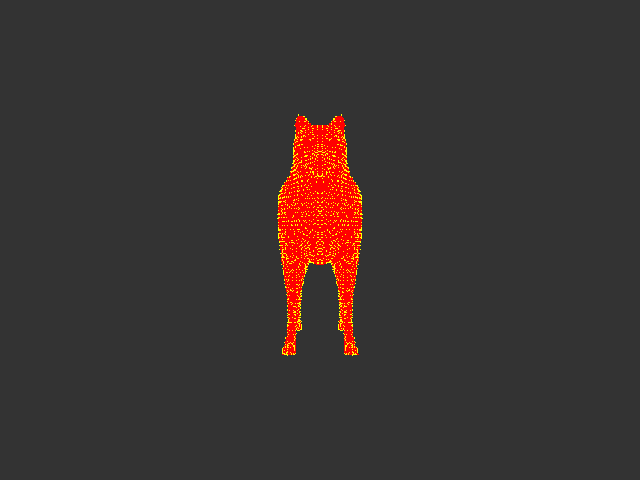
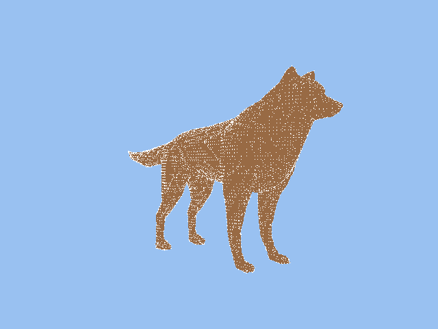

# 🧊 3DViewer v1.0

A lightweight desktop application for viewing and manipulating **Wavefront `.obj` 3D models**.  
Built using **C99**, **OpenGL**, and **Qt 5**, this viewer provides interactive transformation tools and rendering options, including GIF export.

---

## 📸 Preview

<p align="center">
  
</p>

---

## ✨ Features

- 🟢 Supports **.obj** files (vertices + faces)
- ✋ Interactive:
  - Move
  - Rotate
  - Zoom
- 🧱 Wireframe or point rendering
- 🎨 Custom line and vertex colors/sizes
- 🖼️ Image export (.jpeg/.bmp)
- 🎞️ GIF animation export
- 🧪 Unit-tested arithmetic and transformations

---

## 🎬 Demo

| Move Object | Rotate Object | Change Appearance |
|-------------|---------------|-------------------|
|  |  |  |

---

## 📦 Installation

### 🔧 Dependencies

| Dependency | Version | Linux | macOS | Windows |
| ---------- | ------- | ----- | ----- | ------- |
| CMake      | ≥ 3.18  | ✅     | ✅     | ✅       |
| GCC/Clang  | ≥ 10    | ✅     | ✅     | ✅       |
| Qt         | 5.12‑6  | ✅     | ✅     | ✅       |
| OpenGL     | 1.1     | ✅     | ✅     | ✅       |

- C compiler with C99 support  
- C++ compiler (for the Qt viewer parts)  
- Qt 5 (for `QGLWidget`)  
- OpenGL (legacy pipeline)  
- GNU Make (or compatible build tools)  
- `check` testing framework (for unit tests)  

### 🧱 Build Instructions


#### 🔹 Option 1 — Using Make (recommended)

```bash
make all
./viewer/3DViewer
```

#### 🛠️ Build Options

| Target     | Command            | Notes                                      |
| ---------- | ------------------ | ------------------------------------------ |
| Install    | `make install`     | Build the Qt application                   |
| Uninstall  | `make uninstall`   | Remove built files and viewer binaries     |
| Tests      | `make tests`       | Compile and run unit tests using Check     |
| Coverage   | `make gcov_report` | Generate test coverage report (HTML)       |
| Clean      | `make clean`       | Remove build artefacts and temporary files |
| DVI Report | `make dvi`         | Compile LaTeX documentation to PDF         |
| Lint Check | `make clang_n`     | Check format compliance using clang-format |
| Lint Fix   | `make clang_i`     | Auto-format code to Google style           |


#### 🔹 Option 2 — Using Qt Creator (manual)
1. Open viewer/3DViewer_v1.pro in Qt Creator
2. Configure the build
3. Build and run


## 📁 Project Structure

```
3DViewer_v1.0/
├── backend/           # C core (parser + math ops)
│   ├── parser/        # OBJ parser
│   └── operations/    # Move, rotate, scale
├── viewer/            # Qt GUI & OpenGL logic
├── frontend/          # .ui, icons, intro art
├── models/            # Sample .obj files
├── build/             # Compiled artifacts
├── s21_tests.c        # Unit tests (Check framework)
└── 3d_viewer.tex      # Report + UML (LaTeX)
```

## 📐 .OBJ Format Support

The program supports:

- `v` `x` `y` `z` — Vertices

- `f` `i` `j` `k` — Faces (1-indexed)

Unsupported (ignored):

- `vt`, `vn`, `mtl` — Texture/Normal/Material data

### 🔍 Example Input

```
# Simple Cube
v 1.0 1.0 -1.0
v -1.0 1.0 -1.0
v -1.0 1.0 1.0
...

f 1 2 3
f 1 3 4
```

### Core Data Structure

```
typedef struct {
    float *vertices;         // flattened array: x1 y1 z1 x2 y2 z2 ...
    unsigned int *faces;     // indices per face: i0 i1 i2 ...
    unsigned int vertexCount;
    unsigned int faceCount;
} ObjData;
```

## ✅ Tests
Run unit tests:

```
make test
```

Covers:

- Model transformations
- Normalization
- Memory integrity

## 🙌 Acknowledgements
- Developed as part of educational project @ School21 (by Sber)
- Built with Qt and OpenGL.
- Testing powered by Check.
